

# Արքիտեկտոնիկայի տեսական ուղղությունները և նախագծային հիմունքները

Արքիտեկտոնիկան ուսումնասիրում է երեք հիմնական ուղղություններ՝
1. Տարածածավալային կառուցվածքի ներդաշնակում 
2. Կենսաբանական (բիոնիկ) արքիտեկտոնիկ ձևագոյացում
3. Կոնստրուկտիվիզմը որպես ձևափոխման գործընթաց

## Տարածածավալային կառուցվածքի ներդաշնակում

Արքիտեկտոնիկայում եռաչափ կառուցվածքային ձևերը դիտվում են որպես գեղարվեստական արտահայտության ամբողջական նյութական համակարգ:

Ծավալատարածական կառույցի տարրեր են հանդիսանում՝ մակերեսը, ծավալը, տարածությունը և այլն, որոնց կազմը որոշում է կոմպոզիցիայի ձևի օրինաչափությունը: Կոմպոզիցիան ձևի և տարրի միջև համահունչ ամբողջականություն ստեղծելու միջոց է: Նրա նպատակն է ուտիլիտար արդարացված առարկայի ձևի ստացումը, որը կունենա կոնստրուկտիվ և ֆունկցիոնալ էսթետիկ արժեք: Կոմպոզիցոն խնդիրների փնտրումները հիմնաված է որոշակի լուծումների վրա ինչպիսիք են՝ կոնտրաստ, նյուանս, մասշտաբ, սիմետրիա, ասիմետրիա, ստատիկա, դինակիկա, և այլն:  Կոմպոզիցոն միջոցները կիրառվում են նախագծային փնտրումների հարմոնիկ լուծում ստանալու համար: Հարմոնիկ սկզբունքներն ուսումնասիրվել և հավաքվել  են մարդկային սերունդների կողմից և սիստեմավորվել մոդուլային համակարգերի: Հենց այդ համակարգերն են թելադրում հարմոնիկ չափանիշները: Այստեղ պետք է նշել «ոսկե հատման» կանոնը (նկ. 14), որը ներդրեց Լեոնարդո Դավինչին XV դարում: Այդ համակարգերով էին ուղղորդվում ճարտարապետները, քանդակագործները գեղանկարիչները և կիրառական արվեստի նկարիչները ստեղծագործելու ժամանակ:

<table width="100%">
  <tr>
    <td width="100%">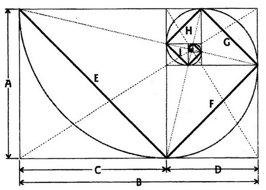</td>
  </tr>
  <tr>
    <td width="100%">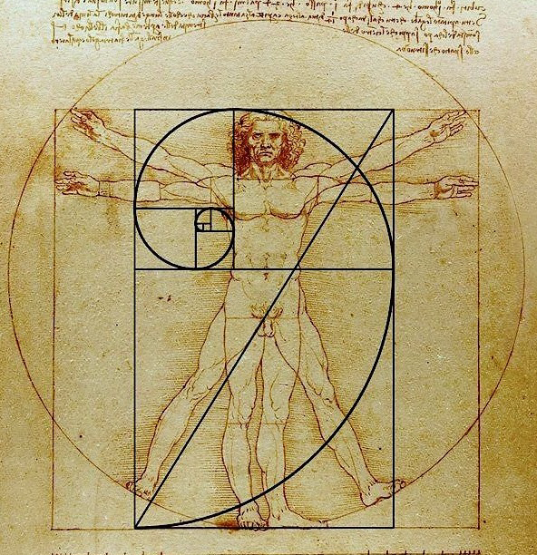</td>
  </tr>
  <tr>
    <td align="middle" colspan="2" >Նկ. 14 Ոսկե հատման կանոն</td>
  </tr>
 </table>

##  Կենսաբանական (բիոնիկ) արքիտեկտոնիկ ձևագոյացում

Կենդանի բնության մեջ ձևը և գործառույթը սերտորեն մոտեցված են և փոխկապակցված: Բնական ձևերը ունեն ներդաշնակ հաջորդականություն մեկ ամբողջության մեջ, ձևի և կառուցվածքի տրամաբանական միասնություն: Կենդանի բնության մեջ ձևագոյացումը բնութագրվում է ճկուն կապերով, աստիճանաբար փոխանցվող անցումներով մի ձևից մյուսին՝ պայմանավորված կառուցվածքի փոխկապակցվածության սկզբունքով: Անսահմանափակ բարդ, զարմանալի գեղեցիկ, թեթև, տնտեսվող կոնստրուկցիաներ, որոնք ստեղծվում են համատեղելով տարրերը: Բնությունը հաճախ միավորում է կոնստրուկցիան, այսինքն կառուցում է միևնույն ձև ունեցող էլեմենտներից: Օրինակ՝ ծաղիկի թերթիկները, սերմերը, հատապտուղները, ձկների կամ օձերի թեփուկները և այլն, որը ցույց է տալիս ռիթմի կիրառումը կենդանական և բուսական աշխարհում (նկ. 15): 

<table width="100%">
  <tr>
    <td width="50%">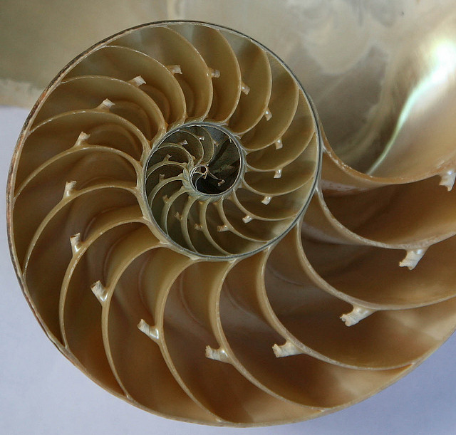</td>
    <td width="50%">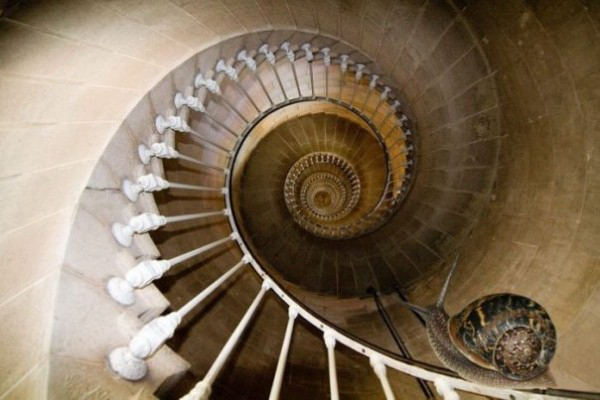</td>
  </tr>
  <tr>
    <td width="50%">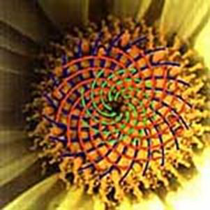</td>
    <td width="50%">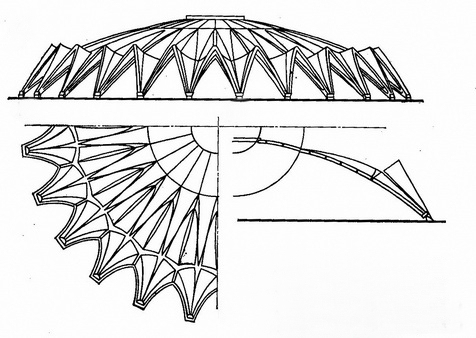</td>
  </tr>
  <tr>
    <td width="50%">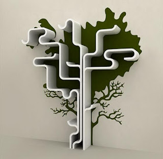</td>
    <td width="50%">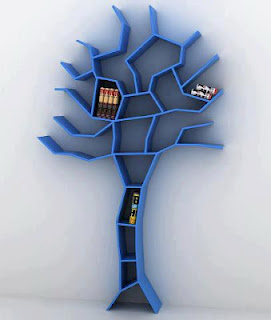</td>
  </tr>
  <tr>
    <td width="50%">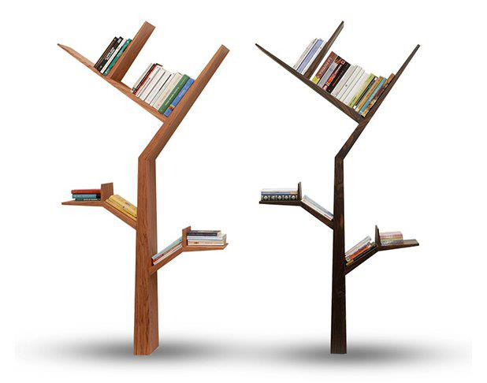</td>
    <td width="50%"></td>
  </tr>
  <tr>
    <td align="middle" colspan="2" >Նկ. 15</td>
  </tr>
 </table>

Հատկապես տպավորիչ են մեղվի բջիջները,  որոնց միակ կոնտստրուկտիվ տարրը վեցանկյուն պրիզման է: Բնական ծագում ունեցող երևույթ է «ոսկե հատման» կանոնը (վերը նշվեց դրա մասին), որը դիտարկվում է մի շարք կենսաբանական և բնական օբյեկտների մոտ: Ձևագոյացումը ցույց է տալիս կենդանի օրգանիզմների զարգացումը և կանոնավորում է նրանց կառուցվածքը՝ հասնելով իդեալական տարբերակի:

##  Կոնստրուկտիվիզմը որպես ձևափոխման գործընթաց

Արվեստի աշխարհում ի հայտ եկած նոր ուղղությունները, ինչպիսիք են՝ կոնստրուկտիվիզմը, դադաիզմը, սյուրռեալիզմը, կոնցեպտուալիզմը (հայեցակարգային), պոպարտը նպաստեցին կինետիկ արվեստի ձևավորմանը: Նոր հասարակարգը և արդյունաբերության զարգացումը առաջացրեցրին նոր արվեստի ուղղություններ՝ «արդյունաբերական արվեստ» և «կոնստրուկտիվիզմ»: XX դարի սկզբին մի շարք եվրոպական երկրներում «կոնստրուկտիվիզմ» (լատ. CONSTRUKTIO-կառուցողականություն) արվեստի հետևորդները հայտարարեցին, որ նոր գեղարվեստական կերպարը ոչ թե կոմպոզիցիան է այլ կառուցվածքը: Նրանք հասան կոմպոզիցիայի գեղարվեստական արտահայտության նոր միջոցների, օգտագործելով նյութերի հնարավորությունները, ինչպիսիք են՝ մետաղը, ապակին, փայտը, ավելի ուշ նաև պլաստիկը, որը շատ մեծ կիրառություն գտավ մեզ շրջապատող ժամանակակից առարկայական աշխարհում:

  Կոնստրուկտիվիզմի բաղկացուցիչ մասն է կազմում տրանսֆորմացիան (լատ. TRANSFORMATIO – վերափոխում): Ձևի փոփոխման եղանակը որոշվում է վերափոխման դինամիկ շարժմամբ: Առաջին վերափոխվող կոնստրուկցիաներն են եղել դռները և պատուհանները: Չինական և ճապոնական ինտերիերները կառուցվել են մշտական փոփոխվող սկզբունքով: Ներքին և արտաքին տարածությունները կապել են թեթև, շարժական շիրմաներով, միջնորմերով և այլն, որը հնարավորություն էր ստեղծում անընդհատ վերափոխել տան հատակագիծը, սահուն ձևով անցումներ կազմակերպել ինտերիերից բակ և շրջակա միջավայր:

Ներկա պահին գոյություն ունեն բազմակի շարժական կոնստրուկտիվ էլեմենտներ, որոնք օգտագործվում են տարբեր մոբիլ առարկաների ստեղծման համար (նկ. 16):

Մոբիլ և տրանսֆորմացվող լուծումներ

<table width="100%">
  <tr>
    <td width="33%">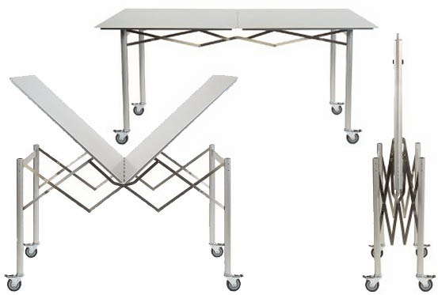</td>
    <td width="33%">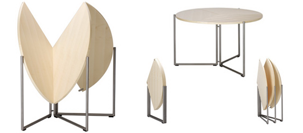</td>
    <td width="33%">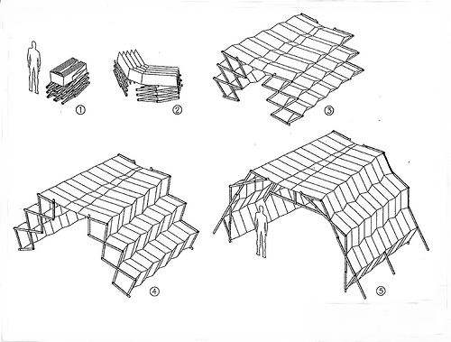</td>
  </tr>
  <tr>
    <td align="middle" colspan="3" >Նկ. 16</td>
  </tr>
 </table>
